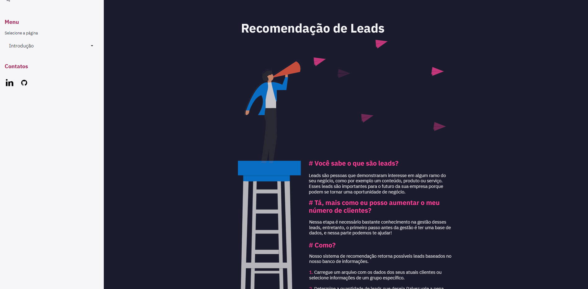
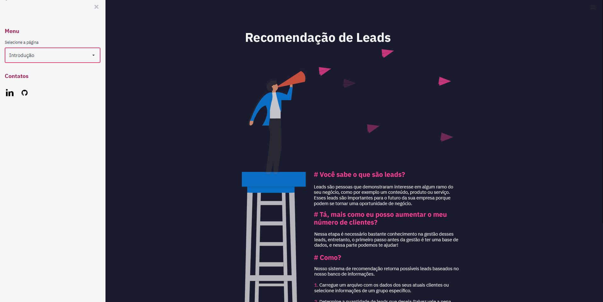

<h1 align="center">
    
</h1>

<h5 align= "center">
    Clique na imagem acima para ir para a aplicação
 </h5>

<h4 align="center">
    AceleraDev Data Science - Projeto Prático 🧲
</h4>

    
    
 </p1>

Um sistema de recomendação é dito como a combinação de várias técnicas computacionais para selecionar itens personalizados com base nos interesses dos usuários e conforme o contexto no qual estão inseridos. Nesse projeto o sistema de recomendação está relacionado a possíveis leads. Com base nas características dos atuais clientes o sistema recomenda outros possíveis clientes por perfil semelhante.

**O que são leads?**

Leads são pessoas que demonstraram interesse em algum ramo do seu negócio, por exemolo um conteúdo, produto ou serviço. Esses leads são importantes para o futuro da empresa porque podem se tornar uma oportunidade de negócio.

## Navegação

Toda a navegação é feita pelo menu lateral à esquerda, nele é possível selecionar as abas da aplicação:

- Introdução: explicação sucinta sobre o projeto
- Exemplos: exemplos com portfólios fixos de como a aplicação funciona
- Gerar leads: área na qual é possível gerar leads a partir de um portfólio ou da seleção de características do cliente.

    

### Exemplos

Na página de exemplos é possível selecionar um dos possíves três portfólios disponíveis para verificar os leads gerados a partir dele, como também selecionar a quantidade de recomendações que deseja receber.

    

### Gerar leads

Na página de gerar leads o usuário pode selecionar entre dois modos de operação **Selecionar grupo** ou **Carregar base de dados**. No modo de selecionar grupo, será necessário selecionar um grupo de características importantes para o lead, já no carregar base de dados deve ser carregado um arquivo com extensão .csv semelhante ao utilizada no projeto.

**Selecionar grupo**

    

**Carregar base de dados**

    

## Tecnologias

- [Python](https://www.python.org/)
- [Streamlit](https://www.streamlit.io/)
- [Heroku](https://www.heroku.com)

